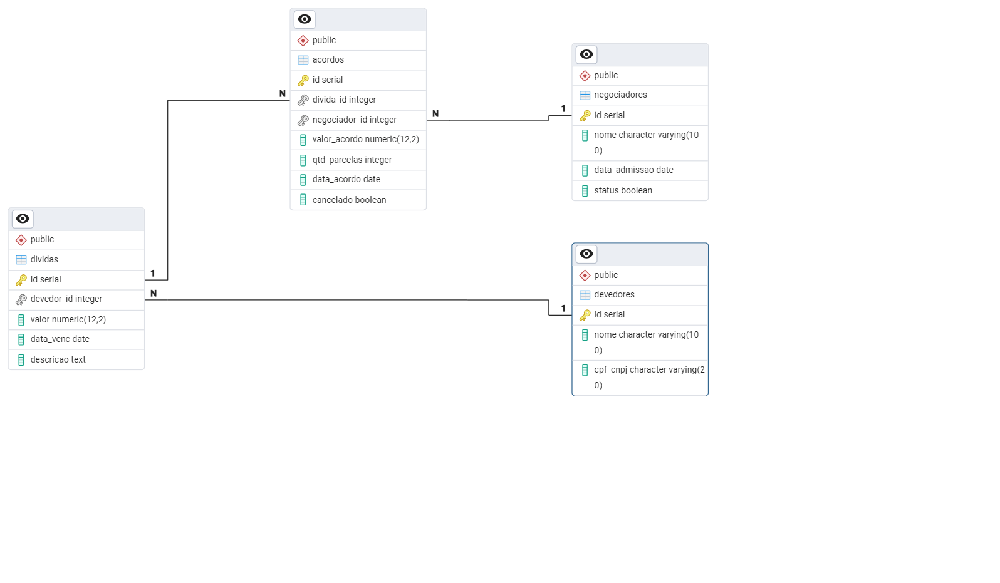

# Agente de Cobrança com LangChain

Este projeto tem como objetivo criar um agente de cobrança inteligente, capaz de interagir com um banco de dados de dívidas e devedores, além de gerar acordos de pagamento personalizados.

## Referência

Este projeto segue o artigo: [Introdução à criação de AI Agents com LangChain : Criando um Agente de Cobrança](https://www.dio.me/articles/introducao-a-criacao-de-ai-agents-com-langchain-criando-um-agente-de-cobranca-f1139653ff1b)

## Visão Geral do Banco de Dados

O banco de dados utilizado foi criado com PostgreSQL. O diagrama entidade-relacionamento (ER) pode ser visualizado abaixo:

### Estrutura das Tabelas

O banco de dados contém as seguintes tabelas:
- `devedores`: informações sobre os devedores
- `dividas`: registros das dívidas
- `acordos`: acordos de pagamento gerados
- `negociadores`: responsáveis pelas negociações

A definição das tabelas está no arquivo [`create_db.sql`](db/create_db.sql), e exemplos de dados podem ser encontrados em [`insert_db.sql`](db/insert_db.sql).
